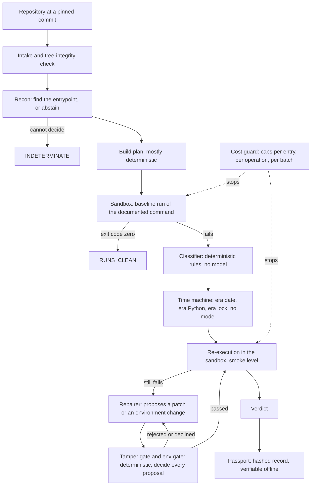

# RERUN

## What it is

RERUN is a reproducibility auditor for research code: it runs a paper's repository in a sandbox, records what happened, and signs the record.
It produces evidence, not hope. Where a model proposes a repair, a deterministic gate decides, and the outcome is measured against a pre-registered gate.
Every number it reports carries a tag (API-REPORTED, ESTIMATED or DERIVED; BILLED for the owner's one account-balance reading) and traces to a committed record.
API-REPORTED (formerly MEASURED) means a stored field of a committed record, or a count or sum of such fields; for a dollar figure it is the sandbox API's reported operation cost, not account billing.

## The measured result

**2 [API-REPORTED] of 24 [API-REPORTED] gate entry-runs reached a RUNS_* verdict and no gate passed; one is a measurement artefact (harness-v1.3.3, entry `11`, smoke limit), the other a 60 [API-REPORTED] s smoke-criterion pass after model-proposed environment changes were adopted (harness-v1.4.2, entry `07`).**
Over every gate entry-run of the exploratory versions, 2 [API-REPORTED] of 24 [API-REPORTED] ended RUNS_CLEAN or RUNS_AFTER_REPAIR, and no gate passed.
The first of the two verdicts (harness-v1.3.3, entry `11`) was a smoke-limit artefact, produced by the deterministic time machine alone.
The second (harness-v1.4.2, entry `07`) is a smoke-criterion pass: its command ran for the smoke limit without failing, after model-proposed environment changes were adopted by the adjudicator; it did not run to completion and no result was reproduced. In the last gate (harness-v1.4.3) the same entry ended BLOCKED: that pass did not repeat.
A model produced a recorded repair attempt in 17 [API-REPORTED] of those 24 [API-REPORTED].

- Pre-registered run (harness-v1.3.2, CONTROL and TREATMENT kept separate): with repair switched on, 0 [API-REPORTED] of 16 [API-REPORTED] repositories reached RUNS_AFTER_REPAIR (the pre-registered primary measure).
- harness-v1.3.3, badge as recorded: `EXPLORATORY — did not pass its pre-registered gate. a: 1/4 (measured), c: 0 citations in 7 searches.`
  Beside it: the one RUNS_AFTER_REPAIR verdict (entry `11`) was later identified as a smoke-limit artefact; the measured line is unchanged.
- harness-v1.3.4, badge as recorded: `EXPLORATORY — did not pass its pre-registered gate. a: 0/4, c: 0 citations (7 attempts consulted, 21 refs, 6 reasons recorded).`
- harness-v1.4.0 (checkpoint images, three candidate repairs per round, an adjudicator that chooses between them, a CPU shim, an exit hook), badge as recorded: `EXPLORATORY — did not pass its pre-registered gate. a: 0/4, c: 3 citations (24 attempts consulted, 72 refs, 15 reasons recorded).`
- harness-v1.4.1 (a rolling funding rate, resume from a kept image, an exit wrapper), badge as recorded: `EXPLORATORY — did not pass its pre-registered gate. a: 0/4, c: 6 citations (36 attempts consulted, 108 refs, 28 reasons recorded).`
- harness-v1.4.2 (partial progress, a wider CPU shim, resource-kill classification with an evidence run), badge as recorded: `EXPLORATORY — did not pass its pre-registered gate. a: 1/4, c: 0 citations (15 attempts consulted, 51 refs, 15 reasons recorded).`
  Beside it: its one RUNS_AFTER_REPAIR is a smoke-criterion verdict, as the paragraph above says. Criterion (c) failed in this gate: no citation was stored.
- harness-v1.4.3, the final gate (output streams read up to a 4 [API-REPORTED] MiB limit with the API's truncation flag, size and hash stored per stream, the API's peak-memory figure stored, a resume path for the gate runner), badge as recorded: `EXPLORATORY — did not pass its pre-registered gate. a: 0/4, c: 7 citations (27 attempts consulted, 81 refs, 17 reasons recorded).`
  Beside it: no entry reached a RUNS_* verdict. Entry `03` ended BLOCKED (DATA_MISSING), entries `07` and `08` BLOCKED (RUNTIME_ERROR_OTHER), entry `11` INDETERMINATE (RESOURCE_LIMIT). The gate ran in two processes after the first was killed (D-43); the interrupted work is not in its records, its spend is in the ledger.

What the last gates found about the harness itself, from its own records:

- Entry `03` hid its error behind a cut stream, and the cut is fixed. Up to harness-v1.4.2 the sandbox SDK returned only the start of each output stream, at a fixed byte limit, and the harness never read the flag that says so (D-41). A probe that re-ran this entry's command on its kept image found a stderr far longer than what was stored, with a CUDA error (`.cuda()` on a CPU-only torch) at its end: that was the "silent exit". The annotation beside every such record reads `stderr truncated at 65,535 bytes, D-41`; their verdicts are unchanged. In harness-v1.4.3 the stream came back whole (400941 [API-REPORTED] bytes), the CPU shim answered the error as a rule with no model call, and the entry ended BLOCKED (DATA_MISSING) on a dataset path that does not exist in the sandbox (an absolute path outside the checkout; whether the repository documents how to obtain it was not examined).
- Entry `11` was killed by the sandbox (exit code 137) in the last two gates. One evidence run read the sandbox from inside: a kernel out-of-memory line, on a VM with 3.85 [DERIVED] GiB of memory and 4 [API-REPORTED] CPUs. That is a sandbox limit, not something a repair can fix: the entry ended INDETERMINATE (RESOURCE_LIMIT), never BLOCKED. The API's own peak-memory figure for the step is now stored (3898376 [API-REPORTED], unit not documented; close to the kilobyte figure in the kernel's quoted line).
- The final gate's process was killed twice by its environment, once with the session that started it and once by a console control event whose sender is not known (D-43, open). It was resumed from complete records under the same tag, caps and order; the interrupted work is not in the gate and its spend is in the ledger as a DERIVED part.

This is a statement about this harness and its repair loop on this corpus, not about the papers and not about automated repair in general.
What a run verifies is execution at smoke level: a re-execution "passes" when it ran for 60 [API-REPORTED] seconds without failing. It does not verify a paper's numerical results.

See it: open [reports/phase-d/dashboard/index.html](reports/phase-d/dashboard/index.html) from disk. The per-version replays are in
[reports/phase-d/replay/index.md](reports/phase-d/replay/index.md); full results of the pre-registered run are in [reports/corpus-v2.1/RESULTS.md](reports/corpus-v2.1/RESULTS.md).

## How it works



- **Sandbox.** Every execution happens in a Nebius Token Factory sandbox, never on the host. The sandbox logs of the seal verification are committed under `runs/sandbox_verification/`.
- **Classifier.** Deterministic rules over exit code and output. It never calls a model.
- **Time machine.** Deterministic: the repository's era date, the Python of that era, and a dependency lock resolved as of that date.
- **Repairer.** A model proposes; it never decides. Each proposal is recorded with its gate decision and its outcome: `applied`, `rejected`, `declined` or `gate_passed_not_executed`.
- **Tamper gate.** Deterministic. It refuses a patch that makes the code do less in order to pass (deleting the evaluation call, swallowing the error, shrinking the data).
- **Cost guard.** Hard caps in code. An operation that reaches its funded limit is stopped and the run ends INDETERMINATE, which is an abstention and not a verdict on the repository.
- **Passport.** One per run record: a hashed bundle, rebuildable from the committed record with zero diff.

## Where Nemotron is used

The model names below are the ones stored in the run records (`config.models`), shown on the dashboard under "How it ran, as recorded". All are prompt-engineered hosted models; nothing is fine-tuned.

| Role | Model, as recorded | What the call does |
|---|---|---|
| recon | `nvidia/NVIDIA-Nemotron-3-Nano-30B-A3B` | Finds the entrypoint to run and abstains (INDETERMINATE) when it cannot |
| planner | `nvidia/nemotron-3-super-120b-a12b` | Adds system packages to an otherwise deterministic build plan |
| repairer | `nvidia/nemotron-3-super-120b-a12b` | Proposes a minimal patch or environment change; the gates decide, never the model |
| adjudicator | `nvidia/Nemotron-3-Ultra-550b-a55b` | Writes the certificate prose; it may only downgrade a verdict, never upgrade one |

Calls recorded in the harness-v1.4.3 gate: Nano 4 [API-REPORTED], Super 39 [API-REPORTED], Ultra 10 [API-REPORTED]. In the pre-registered run: Nano 40 [API-REPORTED], Super 99 [API-REPORTED], Ultra 38 [API-REPORTED].
From harness-v1.4.0 the adjudicator also chooses between up to three candidate repairs per round, re-asked once on an invalid reply, and it still cannot upgrade a verdict.
The small model does the cheap, frequent, abstention-prone job; the mid-size model does planning and repair; the largest writes prose and chooses between candidates under a rule that it cannot improve a verdict.
What the models did, as recorded: model-proposed environment changes were adopted in the one entry-run that ended RUNS_AFTER_REPAIR under the smoke criterion (harness-v1.4.2, entry `07`); in the last gate the same entry ended BLOCKED; no gate passed.

## Where Token Factory is used

- **Sandboxes.** The recorded sandbox backend is `token_factory`, with default image `python:3.10-slim`. Baseline runs and every re-execution run there.
- **Model endpoints.** The three Nemotron models are called through Token Factory's OpenAI-compatible endpoint; each call's token usage is stored in the record (`model_calls`).
- **Prices.** The cost guard prices each call from `https://api.tokenfactory.nebius.com/v1/models?verbose=true (pricing field)`, as recorded with the retrieval date in every record.
- **Seal verification.** Before a harness version is sealed, every sandbox-touching code path is executed live once and its log is committed (`seal_verification.json`).
- **Resource limits.** No document gives a memory or CPU figure for a sandbox VM (`docs/design/D-40-resources.md`), and the SDK has no parameter to choose a larger one. The harness read them from inside: 3.85 [DERIVED] GiB of memory, 4 [API-REPORTED] CPUs, no swap, and a process that holds all the memory is killed by the kernel with exit code 137 (the seal's allocation probe and the last gates' evidence runs agree).
- **Output streams.** The SDK cuts each stream at a default byte limit and sets a flag when it does; harness-v1.4.3 asks for 4 [API-REPORTED] MiB and stores the flag, size and sha256 of every stream (`operations[].streams`). A stream beyond that limit would still lose its end; none of the four records of the last gate did.

## Where Tavily is used

Tavily is called at runtime, once per repair attempt, with the failure's class and error line. The references offered to the model are stored on the attempt as `consulted`; from harness-v1.4.0 the sources the model actually cited are stored too (`cited`).

- harness-v1.4.3 gate: 27 [API-REPORTED] attempts consulted, 81 [API-REPORTED] references, 7 [API-REPORTED] citations, 17 [API-REPORTED] recorded reasons.
- harness-v1.4.2 gate: 15 [API-REPORTED] attempts consulted, 51 [API-REPORTED] references, 0 [API-REPORTED] citations, 15 [API-REPORTED] recorded reasons for not citing.
- harness-v1.4.1 gate: 36 [API-REPORTED] attempts consulted, 108 [API-REPORTED] references, 6 [API-REPORTED] citations, 28 [API-REPORTED] recorded reasons.
- harness-v1.4.0 gate: 24 [API-REPORTED] attempts consulted, 72 [API-REPORTED] references, 3 [API-REPORTED] citations, 15 [API-REPORTED] recorded reasons.
- harness-v1.3.4 gate: 7 [API-REPORTED] attempts consulted, 21 [API-REPORTED] references, 0 [API-REPORTED] citations, 6 [API-REPORTED] recorded reasons.
- harness-v1.3.3 gate: 0 [API-REPORTED] citations in 7 [DERIVED] searches.

The honest note: the model cited a source in three of the four root-cause gates (harness-v1.4.0, v1.4.1 and v1.4.3) and in none of harness-v1.4.2, where criterion (c) failed. Whether a citation shaped a decision is not measured. `cited` is null on every attempt of the harness-v1.3.x passports, and defect D-21 stays open.

## Run it offline in one command

```bash
python -m phase_d.build_dashboard
```

This verifies the passports against the committed record blobs, verifies the REPLAY files against a rebuild, renders `reports/phase-d/dashboard/index.html`, and checks the rendered page. It needs Python and git, no network and no packages.
The page opens from disk: no script, no external resource. To check without writing:

```bash
python -m phase_d.build_dashboard --check
```

## Run it live

Live runs spend money on Nebius. None is needed to inspect the result, and the project's stop rule is in force: the final gate has run and all live work stopped there.

- **Prerequisites.** The backend's dependencies (`backend/pyproject.toml`), git, a Nebius Token Factory API key and a Tavily API key.
- **Environment variables.** Copy `.env.example` to `.env` and set `NEBIUS_API_KEY` and `TAVILY_API_KEY`. The model names and the sandbox backend have recorded defaults.
- **One repository.** `scripts/live_run.py` runs the pipeline once with a hard cost cap (`--cost-cap-usd`).
- **A batch.** `scripts/run_corpus_v1_batch.py` refuses to start unless the checkout is a sealed harness tag with a current seal verification. The sealed tag is `harness-v1.4.3`; `main` is ahead of it by records, reports, documentation and the Phase D assets only (the harness paths are byte-identical to the tag).
- **Cost caps, as recorded.** Entry cap $2.0 [API-REPORTED] in harness-v1.3.3, a cap per entry from $0.7819 [API-REPORTED] to $2.0 [API-REPORTED] in harness-v1.3.4, $1.25 [API-REPORTED] in harness-v1.4.0, $1.5 [API-REPORTED] in harness-v1.4.1 and v1.4.2, and $1.75 [API-REPORTED] in harness-v1.4.3. Batch caps: $25.0 [API-REPORTED] for the pre-registered run; for the six gates $6.0 [API-REPORTED], $3.5 [API-REPORTED], $5.0 [API-REPORTED], $6.0 [API-REPORTED], $6.0 [API-REPORTED] and $7.0 [API-REPORTED] ($6.25 [API-REPORTED] for the last two entries of the last gate, resumed under the lower cap the spend ceiling then allowed).
- **Expected spend per entry.** In the six gates an entry cost between $0.4610 [API-REPORTED] and $1.3058 [API-REPORTED]. In the pre-registered run the cap was not yet hard: one entry reached $5.6773 [API-REPORTED] (D-7).

## Evidence and integrity

- **Passports.** 65 [API-REPORTED] run records, one passport each, under `reports/phase-d/passports/`. A record id is `<harness_tag>/<arm>/<entry>@<sha256 of the committed blob>`; the list is in [reports/phase-d/record_index.md](reports/phase-d/record_index.md).
- **Verifier.** `python -m phase_d.verify_passports` rebuilds every passport from the record blobs and diffs to zero.
- **Tamper tests.** One changed byte in any record changes its record id and fails verification (`backend/tests/test_phase_d_passports.py`). A passport that disagrees with its record stops the REPLAY build (`backend/tests/test_phase_d_replay.py`).
- **Tags.** A check fails the build if any number lacks a tag or a link to its record (`python -m phase_d.check_tags`, `python -m phase_d.check_dashboard`).
- **Never altered.** A recorded value is never edited. A correction is a dated annotation beside the original line.
- **Rules of the instrument.** [reports/phase-d/README.md](reports/phase-d/README.md), [METHODOLOGY.md](METHODOLOGY.md), [DECISIONS.md](DECISIONS.md).

## Defect register summary and status rule

The harness reports on itself: 43 [API-REPORTED] defects, D-1 to D-43, each with quoted sources that the build checks.

- `fixed-and-gated`: 22 [API-REPORTED]. The fix map calls it fixed with no open remainder, and a committed gate report line states the fix was observed working live. It does not mean a gate passed: none did.
- `fixed-unvalidated`: 9 [API-REPORTED]. A fix or correction exists, but no committed gate line shows it working (offline tests, seal only, or a documentation correction).
- `open`: 12 [API-REPORTED]. No fix, a fix the fix map itself calls partial, or a defect that still shows in practice.

The rule is the author's, not the gate's: a partial fix counts as open, and a passed criterion is not a fixed defect. D-23 and D-24 moved to `fixed-and-gated` after the root-cause gates showed them working, and D-39, D-40 and D-41 after the last gate did; their rows say why. D-42 (a non-gating sustained-run line) is `fixed-unvalidated`: no entry ended with a verdict it could label, so it made no live run. D-43 (the gate process that could be killed and was not resumable) is `open`.
The register, with the basis of every row, is on the dashboard and in `reports/phase-d/replay/summary.json`.

## Cost ledger

$29.1704 [ESTIMATED] = $26.2069 [API-REPORTED] + $1.4761 [ESTIMATED] + $1.4874 [DERIVED]. It is a lower bound (D-27): the ledger records only completed cost, and the spend of a killed step is absent wherever no estimate was stored. The DERIVED part is spend parsed from the cost guard's own log lines of the gate attempts that were killed before they wrote a record (D-43), each line quoted with its record id.
These figures are the sandbox API's reported operation cost, not account billing: the account balance page showed at most $0.43 [BILLED] charged at the time of the owner's second reading, and the two are not reconciled (D-36, open).

| Component | API-reported | Estimated | Derived |
|---|---|---|---|
| Seal verification, first attempt, harness-v1.3.3 | $1.2364 [API-REPORTED] | not recorded | none |
| Seal verification, repeat, harness-v1.3.3 | $1.2600 [API-REPORTED] | not recorded | none |
| Smoke gate, harness-v1.3.3 | $2.9298 [API-REPORTED] | $0.0000 [ESTIMATED] | none |
| Seal verification, harness-v1.3.4 | $1.3125 [API-REPORTED] | not recorded | none |
| Smoke gate, harness-v1.3.4 | $3.1120 [API-REPORTED] | $0.2842 [ESTIMATED] | none |
| Seal verification, option B checks, harness-v1.4.0 | $0.6985 [API-REPORTED] | not recorded | none |
| Seal verification, harness-v1.4.0 | $0.1170 [API-REPORTED] | $0.4998 [ESTIMATED] | none |
| Pre-batch upload smoke test, harness-v1.4.0 | $0.0049 [API-REPORTED] | not recorded | none |
| Gate, harness-v1.4.0 | $3.0076 [API-REPORTED] | $0.1868 [ESTIMATED] | none |
| Seal verification, harness-v1.4.1 | $0.1254 [API-REPORTED] | $0.2009 [ESTIMATED] | none |
| Pre-batch upload smoke tests and probe, harness-v1.4.1 | $0.0078 [API-REPORTED] | not recorded | none |
| Gate, harness-v1.4.1 | $3.5247 [API-REPORTED] | $0.0000 [ESTIMATED] | none |
| Seal verification, harness-v1.4.2 | $0.0450 [API-REPORTED] | not recorded | none |
| Pre-batch upload smoke test, harness-v1.4.2 | $0.0051 [API-REPORTED] | not recorded | none |
| Gate, harness-v1.4.2 | $3.9350 [API-REPORTED] | $0.0000 [ESTIMATED] | none |
| Defect probe: one sandbox operation on a kept image, harness-v1.4.2 | $0.0486 [API-REPORTED] | not recorded | none |
| Seal verification: the new output-limit and run-on-image checks, harness-v1.4.3 | $0.0047 [API-REPORTED] | not recorded | none |
| Seal verification, re-run: the checks of the second root-cause version, harness-v1.4.3 | $0.1070 [API-REPORTED] | $0.3045 [ESTIMATED] | none |
| Seal verification, re-run: the checks of the third root-cause version, harness-v1.4.3 | $0.0196 [API-REPORTED] | not recorded | none |
| Seal verification, re-run: the checks of the first root-cause version, harness-v1.4.3 | $0.2907 [API-REPORTED] | not recorded | none |
| Seal verification, re-run: the verifier-script checks, harness-v1.4.3 | $0.7043 [API-REPORTED] | not recorded | none |
| Gate attempts killed before they wrote a record, harness-v1.4.3 | $0.0000 [API-REPORTED] | not recorded | $1.4874 [DERIVED] |
| Pre-batch upload smoke tests (one per gate attempt), harness-v1.4.3 | $0.0156 [API-REPORTED] | not recorded | none |
| Gate, harness-v1.4.3 | $3.6946 [API-REPORTED] | $0.0000 [ESTIMATED] | none |

Rebuilt from the records, the sum equals the figure the last gate report states, to the fourth decimal (its rows are shown rounded, the total is the sum of the unrounded values); the earlier gate reports stated $10.134, $14.6495, $18.5083 and $22.4935 (quoted on the dashboard). The pre-registered run is outside this ledger: its recorded spend is $21.7572 [API-REPORTED].

BILLED lines, from the owner's readings of the account balance (never an API cost; `reports/phase-d/replay/summary.json`, `ledger.billed`):

- Account level, cumulative, not per gate: at most $0.43 [BILLED]. Source: the owner's second reading of the Nebius account balance page ($49.57, after the harness-v1.4.1 seal and gate). Nebius billing lag is unknown.
- The first reading: at most $0.39 [BILLED] ($49.61 of $50.00 at 19:37 local time, 2026-10-01).
- Gate, harness-v1.4.1: $0.04 [BILLED], the difference of the two readings; the ledger recorded far more for the same interval (the dashboard shows both).
- Smoke gate, harness-v1.3.3: BILLED value none. No balance reading was taken for this gate; the only readings are the account-level ones above.
- Smoke gate, harness-v1.3.4: BILLED value none. No balance reading was taken for this gate; the only readings are the account-level ones above.
- Gate, harness-v1.4.0: BILLED value none. No balance reading was taken for this gate; the only readings are the account-level ones above.
- Gate, harness-v1.4.2: BILLED value none yet. The owner's balance reading after this gate has not been received.
- Gate, harness-v1.4.3: BILLED value none yet. The owner's balance reading after this gate has not been received.

## License

`Apache-2.0`. See [LICENSE](LICENSE).

## Known limits

- **D-41, fixed and seen live; two residues.** The cut is fixed from harness-v1.4.3 (the client asks for a larger limit, and the flag, size and hash of every stream are stored), and the last gate read the stream that had been hidden. A stream beyond the new limit would still lose its end; none did. And the records of earlier versions keep what they stored: the annotation `stderr truncated at 65,535 bytes, D-41` sits beside their silent-exit verdicts, and the verdicts are unchanged. A stored stderr tail cannot show whether another earlier verdict also rested on a cut stream; [reports/phase-d/D6_RED_TEAM.md](reports/phase-d/D6_RED_TEAM.md) says what was checked.
- **D-40, fixed as far as the platform lets it be.** The memory limit is read from inside (3.85 [DERIVED] GiB) and the API's peak memory is stored, but the SDK has no parameter for a larger instance: the entry ends INDETERMINATE and the repository gets no verdict.
- **D-42, fixed-unvalidated.** The sustained-run line has not run live: no entry ended RUNS_*. Its primitive was verified live in the seal.
- **D-43, open.** The gate process was killed twice by its environment, the second time by a signal whose sender is not known; the resume path exists and was used once.
- **D-21, open.** The repairer cites in some gates and not in others.
- **D-25, open.** Model-placed diagnostics and the exit hook did not locate a deliberate silent exit (the silent exit that motivated them was a cut stream, D-41). Design note: [docs/design/D-25.md](docs/design/D-25.md).
- **D-26, open.** No reason is recorded when a declined attempt does not cite.
- **D-27, open.** The ledger records only completed cost, so its total is a lower bound.
- **D-28, open.** The record hashes in `reports/corpus-v2.1/results_tables.json` are hashes of worktree files, not of git blobs; the mapping is in the record index.
- **D-36, open.** The ledger is the sandbox API's reported operation cost; the account balance moved far less. Not reconciled, and no balance reading was received for the last two gates.
- **Scope.** Smoke-level execution, one corpus, one repairer model, a small exploratory set. One entry-run ended RUNS_AFTER_REPAIR under the smoke criterion: that is not a rate. The dashboard is a static page, not an interactive product.
- **History.** How the project was built, phase by phase: [docs/history/README_build_log.md](docs/history/README_build_log.md) and [CHANGELOG.md](CHANGELOG.md).
