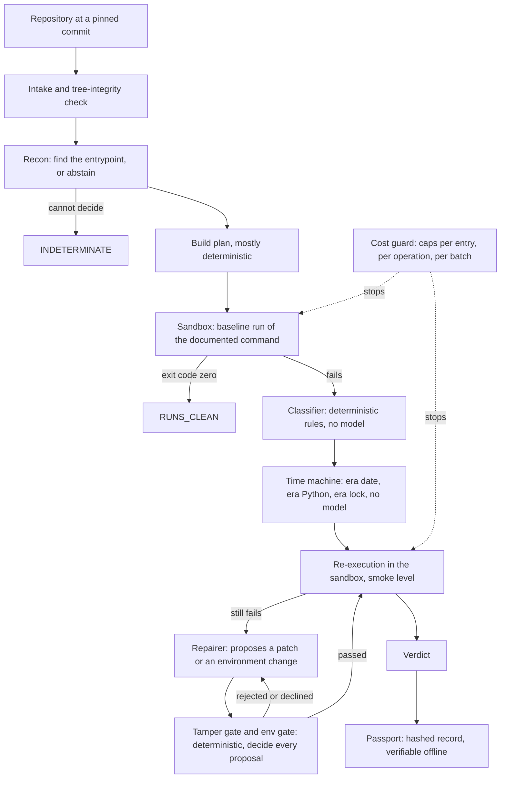

# RERUN

## What it is

RERUN is a reproducibility auditor for research code: it runs a paper's repository in a sandbox, records what happened, and signs the record.
It produces evidence, not hope. Where a model proposes a repair, a deterministic gate decides, and the outcome is measured against a pre-registered gate.
Every number it reports carries a tag (API-REPORTED, ESTIMATED or DERIVED; BILLED for the owner's one account-balance reading) and traces to a committed record.
API-REPORTED (formerly MEASURED) means a stored field of a committed record, or a count or sum of such fields; for a dollar figure it is the sandbox API's reported operation cost, not account billing.

## The measured result

**The LLM repair loop recovered 0 [API-REPORTED] of 8 [API-REPORTED] gate entry-runs.** The one apparent recovery (harness-v1.3.3, entry `11`) was a
smoke-limit artefact, produced by the deterministic time machine alone. The model produced a recorded repair attempt in 5 [API-REPORTED] of those 8 [API-REPORTED].

- Pre-registered run (harness-v1.3.2, CONTROL and TREATMENT kept separate): with repair switched on, 0 [API-REPORTED] of 16 [API-REPORTED] repositories recovered.
- harness-v1.3.3, badge as recorded: `EXPLORATORY — did not pass its pre-registered gate. a: 1/4 (measured), c: 0 citations in 7 searches.`
  Beside it: the one recovery (entry `11`) was later identified as a smoke-limit artefact; the measured line is unchanged.
- harness-v1.3.4, badge as recorded: `EXPLORATORY — did not pass its pre-registered gate. a: 0/4, c: 0 citations (7 attempts consulted, 21 refs, 6 reasons recorded).`

This is a statement about this harness and its repair loop on this corpus, not about the papers and not about automated repair in general.
What a run verifies is execution at smoke level: a re-execution "passes" when it ran for 60 [API-REPORTED] seconds without failing. It does not verify a paper's numerical results.

See it: open [reports/phase-d/dashboard/index.html](reports/phase-d/dashboard/index.html) from disk. The per-version replays are in
[reports/phase-d/replay/index.md](reports/phase-d/replay/index.md); full results of the pre-registered run are in [reports/corpus-v2.1/RESULTS.md](reports/corpus-v2.1/RESULTS.md).

## How it works



- **Sandbox.** Every execution happens in a Nebius Token Factory sandbox, never on the host. The sandbox logs of the seal verification are committed under `runs/sandbox_verification/`.
- **Classifier.** Deterministic rules over exit code and output. It never calls a model.
- **Time machine.** Deterministic: the repository's era date, the Python of that era, and a dependency lock resolved as of that date.
- **Repairer.** A model proposes; it never decides. Each proposal is recorded with its gate decision and its outcome: `applied`, `rejected`, `declined` or `gate_passed_not_executed`.
- **Tamper gate.** Deterministic. It refuses a patch that makes the code do less in order to pass (deleting the evaluation call, swallowing the error, shrinking the data).
- **Cost guard.** Hard caps in code. An operation that reaches its funded limit is stopped and the run ends INDETERMINATE, which is an abstention and not a verdict on the repository.
- **Passport.** One per run record: a hashed bundle, rebuildable from the committed record with zero diff.

## Where Nemotron is used

The model names below are the ones stored in the run records (`config.models`), shown on the dashboard under "How it ran, as recorded". All are prompt-engineered hosted models; nothing is fine-tuned.

| Role | Model, as recorded | What the call does |
|---|---|---|
| recon | `nvidia/NVIDIA-Nemotron-3-Nano-30B-A3B` | Finds the entrypoint to run and abstains (INDETERMINATE) when it cannot |
| planner | `nvidia/nemotron-3-super-120b-a12b` | Adds system packages to an otherwise deterministic build plan |
| repairer | `nvidia/nemotron-3-super-120b-a12b` | Proposes a minimal patch or environment change; the gates decide, never the model |
| adjudicator | `nvidia/Nemotron-3-Ultra-550b-a55b` | Writes the certificate prose; it may only downgrade a verdict, never upgrade one |

Calls recorded in the harness-v1.3.4 gate: Nano 4 [API-REPORTED], Super 16 [API-REPORTED], Ultra 4 [API-REPORTED]. In the pre-registered run: Nano 40 [API-REPORTED], Super 99 [API-REPORTED], Ultra 38 [API-REPORTED].
The small model does the cheap, frequent, abstention-prone job; the mid-size model does planning and repair; the largest writes prose under a rule that it cannot improve a verdict.
What the models did not do is in the result above: no model repair recovered an entry.

## Where Token Factory is used

- **Sandboxes.** The recorded sandbox backend is `token_factory`, with default image `python:3.10-slim`. Baseline runs and every re-execution run there.
- **Model endpoints.** The three Nemotron models are called through Token Factory's OpenAI-compatible endpoint; each call's token usage is stored in the record (`model_calls`).
- **Prices.** The cost guard prices each call from `https://api.tokenfactory.nebius.com/v1/models?verbose=true (pricing field)`, as recorded with the retrieval date in every record.
- **Seal verification.** Before a harness version is sealed, every sandbox-touching code path is executed live once and its log is committed (`seal_verification.json`).

## Where Tavily is used

Tavily is called at runtime, once per repair attempt, with the failure's class and error line. The references offered to the model are stored on the attempt as `consulted`.

- harness-v1.3.4 gate: 7 [API-REPORTED] attempts consulted, 21 [API-REPORTED] references, 0 [API-REPORTED] citations, 6 [API-REPORTED] recorded reasons for not citing.
- harness-v1.3.3 gate: 0 [API-REPORTED] citations in 7 [DERIVED] searches.

The honest note: the model never cited a reference, in any record. `cited` is null on every attempt of every passport, and defect D-21 is open. The search happened; its use by the model is not demonstrated.

## Run it offline in one command

```bash
python -m phase_d.build_dashboard
```

This verifies the passports against the committed record blobs, verifies the REPLAY files against a rebuild, renders `reports/phase-d/dashboard/index.html`, and checks the rendered page. It needs Python and git, no network and no packages.
The page opens from disk: no script, no external resource. To check without writing:

```bash
python -m phase_d.build_dashboard --check
```

## Run it live

Live runs spend money on Nebius. None is needed to inspect the result, and the project's stop rule is in force: no further spend without a new decision.

- **Prerequisites.** The backend's dependencies (`backend/pyproject.toml`), git, a Nebius Token Factory API key and a Tavily API key.
- **Environment variables.** Copy `.env.example` to `.env` and set `NEBIUS_API_KEY` and `TAVILY_API_KEY`. The model names and the sandbox backend have recorded defaults.
- **One repository.** `scripts/live_run.py` runs the pipeline once with a hard cost cap (`--cost-cap-usd`).
- **A batch.** `scripts/run_corpus_v1_batch.py` refuses to start unless the checkout is a sealed harness tag with a current seal verification. The sealed tag is `harness-v1.3.4`; `main` is ahead of it and is not sealed.
- **Cost caps, as recorded.** Entry cap $2.0 [API-REPORTED]. Batch caps: $25.0 [API-REPORTED] for the pre-registered run, $6.0 [API-REPORTED] and $3.5 [API-REPORTED] for the two gates.
- **Expected spend per entry.** In the two gates an entry cost between $0.4610 [API-REPORTED] and $1.2825 [API-REPORTED]. In the pre-registered run the cap was not yet hard: one entry reached $5.6773 [API-REPORTED] (D-7).

## Evidence and integrity

- **Passports.** 49 [API-REPORTED] run records, one passport each, under `reports/phase-d/passports/`. A record id is `<harness_tag>/<arm>/<entry>@<sha256 of the committed blob>`; the list is in [reports/phase-d/record_index.md](reports/phase-d/record_index.md).
- **Verifier.** `python -m phase_d.verify_passports` rebuilds every passport from the record blobs and diffs to zero.
- **Tamper tests.** One changed byte in any record changes its record id and fails verification (`backend/tests/test_phase_d_passports.py`). A passport that disagrees with its record stops the REPLAY build (`backend/tests/test_phase_d_replay.py`).
- **Tags.** A check fails the build if any number lacks a tag or a link to its record (`python -m phase_d.check_tags`, `python -m phase_d.check_dashboard`).
- **Never altered.** A recorded value is never edited. A correction is a dated annotation beside the original line.
- **Rules of the instrument.** [reports/phase-d/README.md](reports/phase-d/README.md), [METHODOLOGY.md](METHODOLOGY.md), [DECISIONS.md](DECISIONS.md).

## Defect register summary and status rule

The harness reports on itself: 28 [API-REPORTED] defects, D-1 to D-28, each with quoted sources that the build checks.

- `fixed-and-gated`: 11 [API-REPORTED]. The fix map calls it fixed with no open remainder, and a committed gate or seal report line states the fix was observed working live. It does not mean the gate passed: neither exploratory gate did.
- `fixed-unvalidated`: 6 [API-REPORTED]. A fix or correction exists, but no committed gate line shows it working.
- `open`: 11 [API-REPORTED]. No fix, a fix the fix map itself calls partial, or a defect that still shows in practice.

The rule is the author's, not the gate's: a partial fix counts as open, and a passed criterion is not a fixed defect. D-24 was fixed after the last gate and is `fixed-unvalidated`: it has run in no gate.
The register, with the basis of every row, is on the dashboard and in `reports/phase-d/replay/summary.json`.

## Cost ledger

$10.1349 [ESTIMATED] = $9.8507 [API-REPORTED] + $0.2842 [ESTIMATED]. It is a lower bound (D-27): the ledger records only completed cost, and the spend of a killed step is absent wherever no estimate was stored.
These figures are the sandbox API's reported operation cost, not account billing: the account balance page showed at most $0.39 [BILLED] charged at the time of the owner's reading, and the two are not reconciled (D-36, open).

| Component | API-reported | Estimated |
|---|---|---|
| Seal verification, first attempt, harness-v1.3.3 | $1.2364 [API-REPORTED] | not recorded |
| Seal verification, repeat, harness-v1.3.3 | $1.2600 [API-REPORTED] | not recorded |
| Smoke gate, harness-v1.3.3 | $2.9298 [API-REPORTED] | $0.0000 [ESTIMATED] |
| Seal verification, harness-v1.3.4 | $1.3125 [API-REPORTED] | not recorded |
| Smoke gate, harness-v1.3.4 | $3.1120 [API-REPORTED] | $0.2842 [ESTIMATED] |

The gate report's own line reads `$10.134`; that figure adds components that were already rounded, and it is quoted beside the record sum on the dashboard. The pre-registered run is outside this ledger: its recorded spend is $21.7572 [API-REPORTED].

BILLED lines, from the owner's reading of the account balance (never an API cost; `reports/phase-d/replay/summary.json`, `ledger.billed`):

- Account level, cumulative, not per gate: at most $0.39 [BILLED]. Source: the owner's reading of the Nebius account balance page, $49.61 of $50.00 at 19:37 local time, 2026-10-01. Nebius billing lag is unknown.
- Smoke gate, harness-v1.3.3: BILLED value none. No balance reading was taken for this gate; the only reading is the account-level one above.
- Smoke gate, harness-v1.3.4: BILLED value none. No balance reading was taken for this gate; the only reading is the account-level one above.

## License

`Apache-2.0`. See [LICENSE](LICENSE).

## Known limits

- **D-21, open.** The repairer never cites a search result, even with a required field.
- **D-23, open.** Per-repair funding starves entries whose every re-execution pays a torch install. Design note: [docs/design/D-23.md](docs/design/D-23.md).
- **D-25, open.** Model-placed diagnostics cannot locate a deliberate silent exit. Design note: [docs/design/D-25.md](docs/design/D-25.md).
- **D-26, open.** No reason is recorded when a declined attempt does not cite.
- **D-27, open.** The ledger records only completed cost, so its total is a lower bound.
- **D-28, open.** The record hashes in `reports/corpus-v2.1/results_tables.json` are hashes of worktree files, not of git blobs; the mapping is in the record index.
- **Scope.** Smoke-level execution, one corpus, one repairer model, a small exploratory set. The dashboard is a static page, not an interactive product.
- **History.** How the project was built, phase by phase: [docs/history/README_build_log.md](docs/history/README_build_log.md) and [CHANGELOG.md](CHANGELOG.md).
